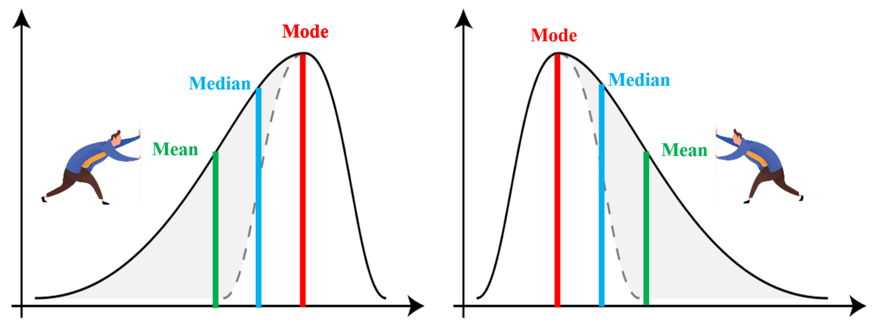
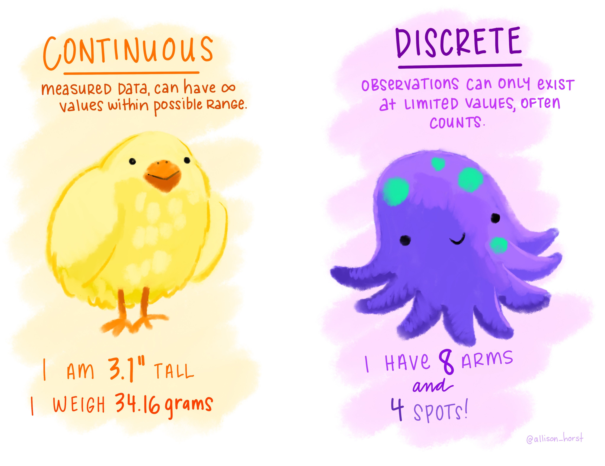

```{r setup, include=FALSE}
knitr::opts_chunk$set(warning=FALSE, message=FALSE)
```

#### Today's agenda (5 min):  

- Q&A/vocabulary list

- Group Discussion

- Writing prompt


#### This Week's Vocab (15-20 min) :  

- Where are the data centered/located (approximate values if available)

- Mean, median, mode

- How much spread? (relative to what?) How are they scaled?

- Standard deviation, variance interquartile range (IQR), range

- Higher order characteristics: shape/skewness/modality

- Shape: symmetric, left-skewed, right-skewed

- The tails of the distribution (heavy-tailed or thin-tailed)

- Modes/modality: where, how many, unimodal, bimodal, multimodal, uniform

- Outliers, extreme values

- Frequency (which category occurred the most or least often; data concentrated near a particular value
or category)

- Different visualizations: bar graph, boxplot, histogram, scatterplot

<center>



[\hspace{90pt}Left Skew\hspace{175pt}Right Skew](https://towardsdatascience.com/skewness-kurtosis-simplified-1338e094fc85)

</center>

#### Discussion (20 min) :  

You've learned about differet types of variables and techniques for visualizing and describing the distribution of the variables. The Iris Dataset is a dataset looking at sepal and petal size of three classes of Iris plants with 50 instances each(collected by R.A. Fisher).


Below are four plots that describe variables in this dataset:

```{r, include=TRUE,echo = FALSE}
library(tidyverse) # Load the tidyverse package to gain access to functions we'll use
library(wesanderson)
library(patchwork)
theme_set(
  theme_bw(base_size = 10)
)
data(iris)
# glimpse(iris)


p1<-ggplot(data = iris, aes(x = Species, y=Sepal.Width)) +
  geom_boxplot(color = "grey",aes(fill=Species)) + scale_fill_manual(values = wes_palette("Moonrise3"))+guides(fill="none")

p2<-ggplot(data = iris, aes(x = Sepal.Width)) +
  geom_histogram(color = "grey",aes(fill=Species),bins = 25) + scale_fill_manual(values = wes_palette("Moonrise3"))+facet_wrap(~Species,nrow = 3)+guides(fill="none")

p3<-ggplot(data = iris, aes(x = Sepal.Width, y=Petal.Width)) +
  geom_point(aes(color=Species)) + scale_color_manual(values = wes_palette("Moonrise3"))+guides(color="none")

# width<-data.frame(species = iris$Species, wid=iris$Sepal.Width/iris$Petal.Width)


p4<-ggplot(data = iris[iris$Sepal.Width > 3,], aes(x = Species)) +
  geom_bar(aes(fill=Species)) +  geom_text(aes(label = paste("n =",..count..)), stat = "count", vjust = .5, colour = "grey3") +
  scale_fill_manual(values = wes_palette("Moonrise3")) + ylab ("# Iris with Sepal Width greater than 3 cm")


p1+p2+p3+p4
```

\newpage

**Discuss**: 

What type of variable is displayed in the plot?

(Quantitative/Categorical)
 

{width=50%}
{width=50%}


What type plot is used to visualize the variable?

(Boxplot, Histogram, Barplot, Scatterplot)

Which plots are appropriate for which types of variables?

- Histogram: Quantitative/numerical
- Boxplot: Quantitative/numerical; Quantitative/numerical+Categorical
- Barplot: Categorical
- Scatterplot:Quantitative/numerical+Quantitative/numerical

What features of the variable can you see from the plot?

- Histogram/Boxplot: shape, center, spread
- Barplot: Most common? Least common? How many times more common?

\newpage

#### Writing prompt (30 min) :  

Pretend that you are on the phone with your friend, and you want to share some of the cool new data visualization techniques that you have been learning in STA130. Pick one of the plots above generated from *the Iris Dataset* and prepare a small paragraph on how you would describe the graph to your friend (keeping in mind that they cannot see the graph). Make sure you include at least 2 words/phrases from your vocabulary list. It is also important to keep in mind that the person you are talking to has not taken STA130, therefore they will not be as familiar with the statistical vocabulary as you are. Therefore, make sure the explain any terms you use in plain language.  

 

### When describing a figure, it is important to:  

- Describe the data source  
- State the type of graph  
- Identify what are on the x- and y-axis (if appropriate)  
- Describe the distribution  
- Make note of potential outliers  

 
### Vocabulary List  

- Where are the data centered (approximate values if available)  
- How much spread (relative to what?)  
- Shape: symmetric, left-skewed, right-skewed  
- The tails of the distribution (heavy-tailed or thin-tailed)  
- Modes: where, how many, unimodal, bimodal, multimodal, uniform  
- Outliers, extreme values  
- Frequency (which category occurred the most or least often; data concentrated near a particular value or category)  
- Mean, median, mode  
- Standard deviation, interquartile range  

 

### Some general reminders  

- Try to not send more than 20 minutes on the prompt.  
- Aim for more than 200 words but less than 500 words.  
- Use full sentences. 
- Grammar is *not* the main focus of the assessment, but it is important that you communicate in a clear and professional manner. I.e., no slang or emojis should appear. 
- Be specific. A good principle when responding to a writing prompt in STA130 is to assume that your audience is not aware of the subject matter (or in this case has not read the syllabus). Therefore, in this case, you need to properly communicate what the objective is putting it in your own words (paraphrasing). You CANNOT just copy the learning objective and put it in quotation marks.  